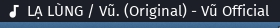

# polybar-mediaplayer

A minimal script to get current media title and artist for [Polybar](https://github.com/jaagr/polybar) which playerctl support

  

## Dependencies
* [python3](https://www.python.org)
* [Nerd Font](https://nerdfonts.com/)
* [playerctl](https://github.com/altdesktop/playerctl)

## Usage
```  
[module/mediaplayer]  
type = custom/script
interval = 2
exec = /path/to/mediaplayer_get.py
````

